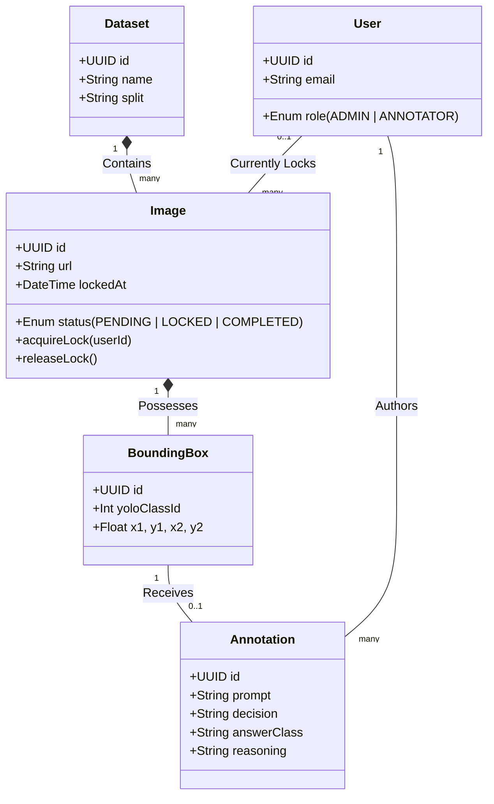

# VLM Studio - Comprehensive Guide

This document serves as both a detailed User Manual for operators and a Technical Architecture Guide for developers.

---

## Part 1: User Manual & Features

### 1. Project Overview
VLM Studio is a specialized web-based annotation tool built with Streamlit. Its primary purpose is to convert standard Object Detection datasets (YOLO format bounding boxes) into rich, conversational Vision-Language Model (VLM) instruction-tuning datasets. It allows annotators to rapidly generate Q&A pairs (VQA) based on specific regions of an image.

### 2. Core Features
*   **Semantic Reasoning Annotation:** Go beyond simple bounding boxes by attaching detailed reasoning and subclass information to objects.
*   **Auto-Detection:** Automatically reads YOLO dataset labels to enforce binary classification (e.g., Weapon vs. Non-Weapon) to prevent annotator errors.
*   **Dynamic Template System:** Create, edit, and inject variables (like bounding box coordinates) into prompts without touching the codebase.
*   **Context Expansion UI:** View isolated crops of the objects being annotated to make highly accurate decisions.
*   **Automated Formatting:** Exports directly to the complex JSON/JSONL conversational arrays required by Qwen2-VL.
*   **Dataset Split Awareness:** Automatically organizes exports into `train`, `valid`, and `test` files based on the image's original folder.

### 3. Step-by-Step Usage Guide

#### Step A: Preparing the Dataset
Ensure your dataset is in the YOLO format and structured inside a root `dataset/` folder like so:
```text
dataset/
    train/
        images/
        labels/
    valid/
        images/
        labels/
    ...
```
Once the folder is placed in the project directory, run `streamlit run app.py`.

#### Step B: Navigation & UI
*   **Left Sidebar:** Use the dropdowns to select your dataset split (train/valid) and search for specific images. Use the `Prev`, `Next`, and `Skip` buttons to cycle through the dataset.
*   **Center Panel (Image Viewer):** Displays the image and YOLO bounding boxes.
    *   🟦 **Blue (Thick Line):** The active object you are currently annotating.
    *   🟩 **Green (Thin Line):** Objects you have already successfully annotated.
    *   🟥 **Red (Thin Line):** Objects pending annotation.
    *   Use the `Prev BBox` and `Next BBox` buttons below the image to cycle through objects in the same image.

#### Step C: The Annotation Workflow (Right Panel)
For the active (Blue) bounding box:
1.  **Prompt Template:** Choose a question to ask the AI. The bounding box coordinates (e.g., `<box>(x1,y1,x2,y2)</box>`) will automatically inject into the prompt.
2.  **Final Decision:** The tool reads the YOLO class and locks this in for you (e.g., Class 2 = Weapon).
3.  **Answer Template:** Select the specific subclass (e.g., "Handgun" or "Smartphone"). 
4.  **Reasoning:** Once an Answer Template is selected, a pre-written, high-quality reasoning text will populate the text box. Review it and edit it if necessary for this specific image.
5.  Click **Save Annotation**. The system will record the data and automatically move you to the next bounding box!

#### Step D: Exporting Data
When you are ready to export, look at the bottom of the Left Sidebar:
*   Click **Export to Qwen2-VL (JSONL)**.
*   The tool will generate files like `train.jsonl` and `valid.jsonl` in the `exports/` folder, completely formatted and ready for model training.

---

## Part 2: Technical & Development Guide

### 1. Technology Stack
*   **Core Framework:** Streamlit (Python 3)
*   **Image Processing:** Pillow (`PIL`), `opencv-python-headless`
*   **External Integrations:** Roboflow API
*   **Data Handling:** JSON manipulation for VQA formatting

### 2. Directory & Module Structure
The project uses a modular component architecture:
```text
├── app.py                      # Main entry point; orchestrates layout and global state
├── config.py                   # Global constants, colors, classes, and default templates
├── components/                 
│   ├── annotation_panel.py     # Right-side form (Prompt/Reasoning inputs)
│   ├── image_viewer.py         # Center panel (Pillow rendering logic)
│   ├── navigation.py           # Left sidebar (State navigation)
│   └── templates.py            # Dynamic template CRUD operations
├── utils/                      
│   ├── dataset.py              # File system I/O (loading images, checking splits)
│   ├── exporter.py             # Logic for converting state into Qwen2-VL JSON/JSONL format
│   └── yolo.py                 # Math for parsing YOLO normalized coordinates to absolute pixels
└── templates.json              # (Auto-generated) Stores user-modified prompt templates
```

### 3. Core State Management
Streamlit reruns the script top-to-bottom on interaction. To maintain persistence, the app relies on `st.session_state`:
*   `st.session_state.current_image_idx` & `selected_bbox_idx`: Tracks the integer indices of the user's current location in the dataset.
*   `st.session_state.annotations`: The master dictionary holding all unsaved/saved annotations in browser memory. 
    *   **Structure:** `{ "image_path": { bbox_id: { "prompt": "...", "reasoning": "...", ... } } }`

**Crucial UI State Patterns:**
To prevent Streamlit widgets (like `st.text_area`) from retaining old data when switching images, we avoid `st.form` wrappers and strictly enforce dynamic keys: e.g., `key=f"reasoning_{image_path}_{bbox['bbox_id']}"`. We also use explicit `on_change` callbacks to force widget memory updates.

### 4. Key Workflows (Under the Hood)
*   **YOLO Parsing:** YOLO stores bounding boxes as normalized coordinates: `[class_id] [x_center] [y_center] [width] [height]`. `utils/yolo.py` reads the image dimensions and converts these into absolute pixel coordinates `(x1, y1, x2, y2)`.
*   **Split-Aware Exporting:** `utils/exporter.py` iterates through `st.session_state.annotations`, reads the root directory of the `image_path` (e.g., `train/`), and dynamically groups output JSON objects into isolated files (`train.jsonl`, `valid.jsonl`).

### 5. Future Roadmap & PRD (Product Requirements Document)

The next major iteration of VLM Studio is a complete migration from Streamlit to a **Next.js (React) Web Application**. This migration aims to solve the single-user limitation of Streamlit by introducing a robust backend, persistent storage, and true multi-user collaboration.

#### A. Functional Requirements (FR)
*   **FR1: Authentication & Role Management**
    *   System must use **NextAuth.js** to handle user login.
    *   System must support Roles: `ADMIN` (can upload datasets and export) and `ANNOTATOR` (can only annotate assigned datasets).
*   **FR2: Persistent Storage & Parsing**
    *   System must parse YOLO dataset folders on upload.
    *   Images are uploaded to object storage (e.g., AWS S3 or local disk).
    *   YOLO labels are immediately parsed and stored as individual `BoundingBox` records in PostgreSQL.
*   **FR3: Concurrency & Image Locking (The Core Logic)**
    *   To prevent collision, the system must implement a **Pessimistic Locking Mechanism**.
    *   When Annotator A requests an image, the backend updates the `Image` record to `status = LOCKED` and assigns `lockedById = Annotator_A`.
    *   If Annotator B requests work, the database queries for `status = PENDING`. Annotator B will never be served Annotator A's locked image.
    *   Locks must have a TTL (Time-To-Live) of e.g., 15 minutes. A background cron job releases stale locks back to `PENDING`.
*   **FR4: Annotation Engine (Frontend)**
    *   React-based canvas to render images and bounding boxes interactively.
    *   Form state managed via React Hook Form. Submissions `POST` via tRPC or Next.js Server Actions to the database.
*   **FR5: Dataset Generation Pipeline**
    *   Admins can click "Export" to trigger a backend pipeline that aggregates all `Annotation` records and builds the final `Qwen2-VL` JSONL files.

#### B. Database Schema (Prisma)
Below is the proposed Prisma schema to support this logic:

```prisma
datasource db {
  provider = "postgresql"
  url      = env("DATABASE_URL")
}

model User {
  id          String       @id @default(uuid())
  email       String       @unique
  role        Role         @default(ANNOTATOR)
  lockedImgs  Image[]      @relation("ImageLock")
  annotations Annotation[]
}

enum Role {
  ADMIN
  ANNOTATOR
}

model Dataset {
  id        String   @id @default(uuid())
  name      String
  split     String   // train, valid, test
  images    Image[]
}

model Image {
  id          String        @id @default(uuid())
  datasetId   String
  dataset     Dataset       @relation(fields: [datasetId], references: [id])
  url         String
  status      ImageStatus   @default(PENDING)
  
  // Locking Logic
  lockedById  String?
  lockedBy    User?         @relation("ImageLock", fields: [lockedById], references: [id])
  lockedAt    DateTime?

  bboxes      BoundingBox[]
}

enum ImageStatus {
  PENDING
  LOCKED
  COMPLETED
}

model BoundingBox {
  id          String       @id @default(uuid())
  imageId     String
  image       Image        @relation(fields: [imageId], references: [id])
  yoloClassId Int
  x1          Float
  y1          Float
  x2          Float
  y2          Float
  
  annotation  Annotation?
}

model Annotation {
  id          String       @id @default(uuid())
  bboxId      String       @unique
  bbox        BoundingBox  @relation(fields: [bboxId], references: [id])
  userId      String
  user        User         @relation(fields: [userId], references: [id])
  
  prompt      String
  decision    String
  answerClass String
  reasoning   String       @db.Text
  createdAt   DateTime     @default(now())
}
```

#### C. System Architecture & Class Diagram
The following Mermaid diagram outlines the entity relationships and how the locking logic bridges Users to Images and Annotations.


